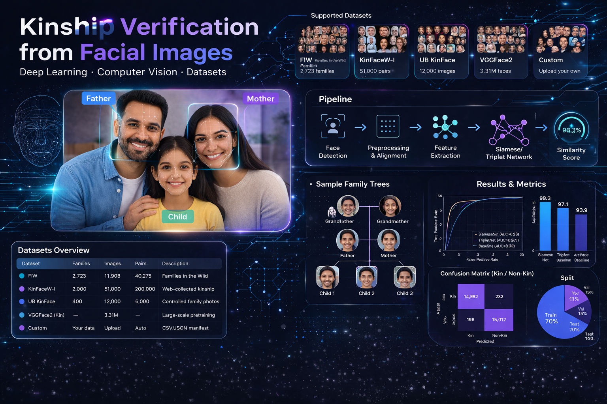
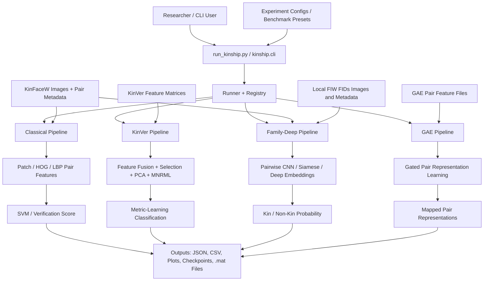

# Kinship Python Toolkit




A unified research toolkit for **kinship verification from face imagery**.

This repository brings together multiple strands of kinship-verification research into one maintainable Python codebase. Instead of scattered scripts, mixed runtimes, and dataset-specific entrypoints, the toolkit provides a single place to run, compare, reproduce, and extend experiments across classical feature pipelines, metric-learning methods, deep models, and Gated Autoencoder style representation learning.

## Why This Project Matters

Kinship verification sits at the intersection of:

- face analysis
- representation learning
- metric learning
- family-structure modeling
- explainable and reproducible biometric research

It is a difficult problem because kinship cues are often **subtle, noisy, age-dependent, and non-identical**. Unlike identity verification, the model is not trying to match the same person across images. It is trying to detect inherited facial structure, family resemblance, and relationship-specific similarity under variation in pose, age, lighting, expression, and image quality.

That makes this toolkit valuable as a research platform for:

- benchmarking multiple kinship verification approaches in one place
- studying how handcrafted and learned features behave differently
- reproducing experiments on bundled kinship datasets
- building cleaner ablations, reports, and new algorithm variants
- providing a strong base for future publication-quality experiments

## What This Toolkit Does

The toolkit provides a single Python interface for four major algorithm families:

- `classical`
  - Handcrafted feature pipelines derived from classical HOG/LBP-style kinship verification work
  - Supports `random`, `kfold`, and `chisq`
- `kinver`
  - Metric-learning style pipeline over bundled precomputed feature representations
  - Supports feature fusion, dimensionality reduction, Fisher-style selection, and MNRML-style projection
- `family-deep`
  - Native deep learning kinship pipeline for `kinfacew` and `fiw`
  - Supports train, test, and demo-style execution through one CLI
- `gae`
  - Native Gated Autoencoder style feature-mapper for pairwise representation learning
  - Supports `standard` and `multiview`

Everything is wrapped in:

- one CLI
- one config system
- one reporting/output layout
- one test suite
- one repo-local data layout

## Research Value

This repository is important not just because it runs algorithms, but because it creates a **shared experimental language** across very different families of methods.

With this toolkit, we can:

- compare classical vs learned methods under one framework
- study representation transfer across KinFaceW and FIW-style settings
- inspect how feature-level and embedding-level methods differ
- benchmark reproducibility without switching languages or toolchains
- extend the project with new backbones, new datasets, and new evaluation protocols

In other words, this is not just an implementation repo. It is a **research infrastructure repo** for kinship verification.

## End-to-End Flow

The diagram below shows how the toolkit turns datasets, pair metadata, and feature inputs into reproducible kinship-verification results.



### What Each Branch Means

- `classical`
  - starts from face pairs
  - extracts handcrafted pair descriptors
  - uses classical verification models such as SVM-based decision boundaries
- `kinver`
  - starts from bundled feature matrices
  - performs feature fusion, selection, projection, and fold-wise evaluation
  - returns relationship-specific verification accuracy
- `family-deep`
  - starts from paired face images
  - learns similarity through native deep models
  - produces kin / non-kin predictions, metrics, and checkpoints
- `gae`
  - starts from left/right pair feature matrices
  - learns gated pairwise structure representations
  - writes mapped features for downstream research workflows

## Repository Layout

```text
kinship-python-toolkit/
|-- configs/
|   |-- benchmarks/
|   `-- experiments/
|-- data/
|   |-- family/
|   |-- kinface/
|   `-- kinver/
|-- src/
|   `-- kinship/
|-- tests/
|-- run_kinship.py
|-- pyproject.toml
`-- README.md
```

### Key folders

- `src/kinship/algorithms`
  - all maintained algorithm implementations
- `src/kinship/datasets`
  - dataset loading and metadata handling
- `src/kinship/features`
  - reusable feature extraction utilities
- `configs/experiments`
  - single experiment presets
- `configs/benchmarks`
  - grouped benchmark presets
- `data`
  - bundled runtime datasets and metadata used by the toolkit
- `outputs`
  - generated run artifacts, reports, checkpoints, and summaries

## Bundled Data

The repository already includes the runtime data needed for the maintained paths:

- `classical`
- `kinver`
- `gae`
- `family-deep` on `kinfacew`

Bundled repo-local data:

- `data/kinface`
  - `KinFaceW-I`
  - `KinFaceW-II`
  - `traindata`
  - `testdata`
- `data/kinver`
  - `data-KinFaceW-I`
  - `data-KinFaceW-II`
- `data/family/data`
  - FIW metadata CSV files
- `data/FIDs`
  - local FIW FIDs image bundle and supporting FIW metadata when available

FIW note:

- The maintained `family-deep` pipeline now supports the repo-local `data/FIDs/FIDs` layout directly
- These FIW assets are intentionally git-ignored because they are large and should stay local rather than being pushed to GitHub
- The loader resolves mismatched FIW face indices within the expected family folder when possible and skips unresolved pairs when a local export is incomplete

See [data/README.md](data/README.md) for the bundled data note.

## Installation

### 1. Create and activate a Python environment

```powershell
python -m venv .venv
.venv\Scripts\Activate.ps1
```

### 2. Install the base toolkit dependencies

```powershell
python -m pip install -U pip
python -m pip install numpy scipy scikit-learn pandas matplotlib pillow scikit-image pytest
```

### 3. Install optional deep-learning dependencies if you want `family-deep`

```powershell
python -m pip install torch torchvision tqdm facenet-pytorch torchfile
```

### 4. Sanity check the installation

```powershell
python run_kinship.py list
```

## Step-by-Step Usage

## 1. See what the toolkit can run

```powershell
python run_kinship.py list
```

This prints:

- available algorithms
- available experiment presets
- available benchmark presets

## 2. Run a classical kinship baseline

```powershell
python run_kinship.py classical --dataset KinFaceW-I --relation fs --method kfold
```

What this does:

- loads KinFaceW-I father-son pairs
- extracts the classical pair features
- runs 5-fold evaluation
- prints fold scores and mean accuracy

## 3. Run the KinVer pipeline

```powershell
python run_kinship.py kinver --dataset KinFaceW-II --relation fs
```

What this does:

- loads precomputed feature matrices
- performs the KinVer-style fusion and projection workflow
- evaluates across folds
- returns fold scores, learned fusion weights, and mean accuracy

## 4. Run a native GAE experiment

```powershell
python run_kinship.py run-config gae-fs-train-p16-standard
```

What this does:

- loads a real bundled `fs` training pair matrix from `data/kinface/traindata`
- runs the native standard GAE mapper
- writes the resulting mapped representation to `outputs/gae-real`

To run the multiview variant:

```powershell
python run_kinship.py run-config gae-fs-train-p16-multiview
```

## 5. Train the native deep kinship model on KinFaceW

```powershell
python run_kinship.py run-config family-deep-kinfacew-small-siamese-train
```

What this does:

- trains the native `small_siamese_face_model`
- runs across KinFaceW-II folds
- writes logs to `outputs/family-deep-real/train-logs`
- saves fold checkpoints under `outputs/family-deep-real/checkpoints`

## 6. Test the trained deep model

```powershell
python run_kinship.py run-config family-deep-kinfacew-small-siamese-test
```

Important:

- this test preset expects the fold checkpoints produced by the train preset
- if checkpoints do not exist yet, run the train preset first

## 7. Train the native deep kinship model on local FIW FIDs data

```powershell
python run_kinship.py run-config family-deep-fiw-small-siamese-fs-train
```

What this does:

- loads FIW pair metadata from `data/family/data`
- resolves paired face images from `data/FIDs/FIDs`
- trains the native `small_siamese_face_model`
- writes logs to `outputs/family-deep-fiw-real/train-logs`
- saves pair-type checkpoints under `outputs/family-deep-fiw-real/checkpoints`

## 8. Test the trained FIW model

```powershell
python run_kinship.py run-config family-deep-fiw-small-siamese-fs-test
```

Important:

- this test preset expects the checkpoints produced by the FIW train preset
- if checkpoints do not exist yet, run the FIW train preset first

For a lighter end-to-end FIW validation on CPU, you can run a single relationship type directly:

```powershell
python run_kinship.py family-deep --mode train --dataset-name fiw --data-path data/FIDs/FIDs --model-name small_siamese_face_model --bs 256 --num-epochs 1 --pair-types fs --output-dir outputs/family-deep-fiw-fs/train-logs --checkpoints-dir outputs/family-deep-fiw-fs/checkpoints
python run_kinship.py family-deep --mode test --dataset-name fiw --data-path data/FIDs/FIDs --model-name small_siamese_face_model --bs 256 --pair-types fs --output-dir outputs/family-deep-fiw-fs/test-logs --checkpoints-dir outputs/family-deep-fiw-fs/checkpoints
```

## 9. Run a benchmark preset

```powershell
python run_kinship.py benchmark native-ports
```

This benchmark runs representative native experiments and produces:

- per-run `result.json`
- benchmark `summary.json`
- benchmark `summary.csv`

## Recommended First Run Path

If you want the fastest path to confirm the repo is healthy:

```powershell
python run_kinship.py list
python run_kinship.py run-config classical-fs-kfold-smoke
python run_kinship.py run-config kinver-fs-smoke
python run_kinship.py run-config gae-fs-train-p16-standard
python run_kinship.py run-config family-deep-kinfacew-small-siamese-train
python run_kinship.py run-config family-deep-kinfacew-small-siamese-test
```

If you have local FIW assets under `data/FIDs`, you can also run:

```powershell
python run_kinship.py run-config family-deep-fiw-small-siamese-fs-train
python run_kinship.py run-config family-deep-fiw-small-siamese-fs-test
```

## Outputs and Reproducibility

Every config-driven run writes a timestamped folder under `outputs/`.

Typical artifacts include:

- `result.json`
- `summary.txt`
- `summary.json`
- `summary.csv`
- plots
- checkpoints
- generated `.mat` feature outputs

This structure is designed for:

- experiment traceability
- side-by-side comparison
- reproducible reruns
- easy export into papers, reports, and notebooks

## Example Research Workflows

### Compare classical and learned methods

```powershell
python run_kinship.py run-config classical-fs-kfold-smoke
python run_kinship.py run-config kinver-fs-smoke
python run_kinship.py run-config family-deep-kinfacew-small-siamese-test
```

### Study feature-mapper behavior

```powershell
python run_kinship.py run-config gae-fs-train-p16-standard
python run_kinship.py run-config gae-fs-train-p16-multiview
```

### Produce a compact benchmark table

```powershell
python run_kinship.py benchmark native-ports
```

## Testing

Run the test suite with:

```powershell
$env:PYTHONPATH='src'
python -m pytest tests -q -p no:cacheprovider
```

Compile check:

```powershell
python -m compileall src run_kinship.py
```

## Responsible Research Note

Kinship verification is a sensitive research area connected to biometrics, privacy, and family inference. This repository is intended for:

- academic research
- reproducible experimentation
- benchmarking and method development

It should be used thoughtfully and with appropriate ethical, legal, and institutional oversight.

## Current Status

- unified maintained Python codebase
- repo-local bundled runtime data
- native algorithm implementations
- config-driven experiments
- benchmark presets
- tested command-line interface

This repository is ready to serve as a clean foundation for:

- future kinship-verification publications
- reproducible experiments
- student onboarding
- model extensions
- comparative benchmarking

## In Short

This toolkit transforms a difficult, fragmented research space into a **coherent, extensible, and reproducible Python platform** for kinship verification.

It is not just a port.

It is the base of a serious research project.
